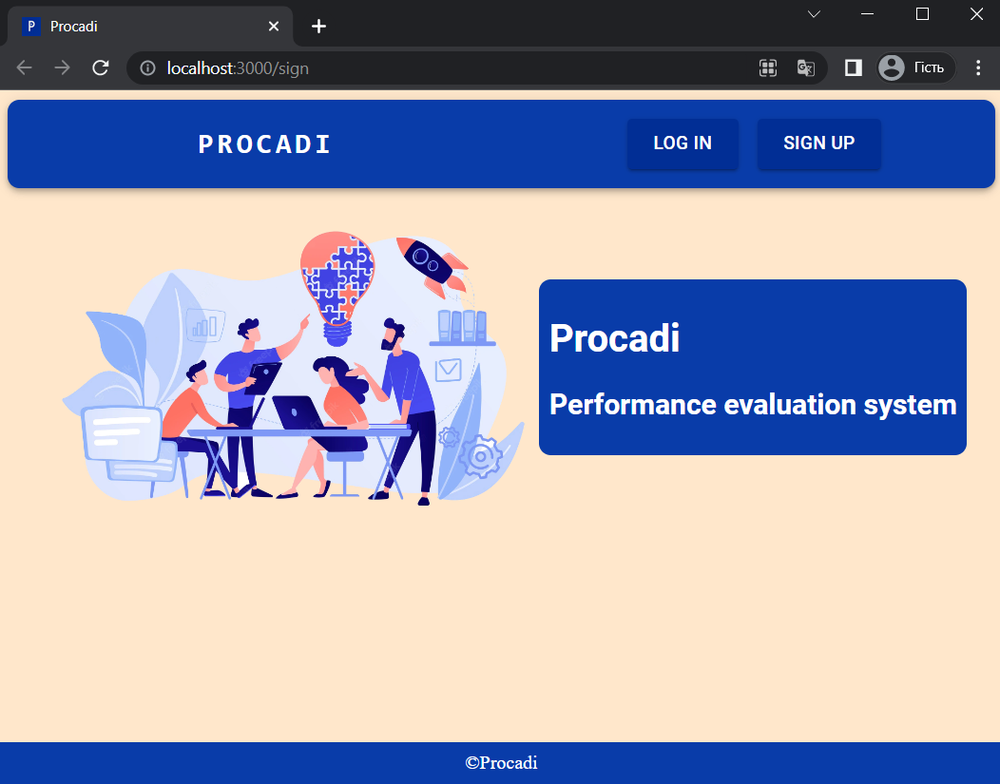

# PROCADI - Performance evaluation system

## About
Procadi. This  application in general for small companies and startups. It helps to owners and managers 
evaluate the quality of work of employees. Not just helps, but automate all processes related to it, 
such as creating a feedback, compare feedbacks of each employee, add personal property sets to each employee and the best
that all info will in one place.

## Technologies:
### backend: 
* swagger
* flask
* postman
* sqlAlchemy orm
* alembic
* marshmallow
* JWT(json web token)

### frontend
* React
* Node Js
* React Router Dom
* Material UI